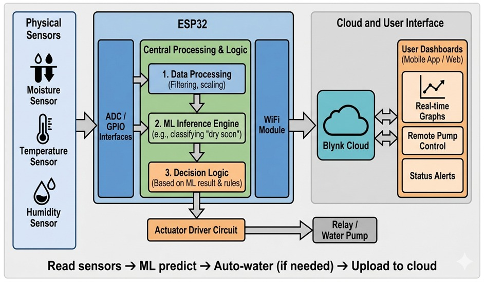
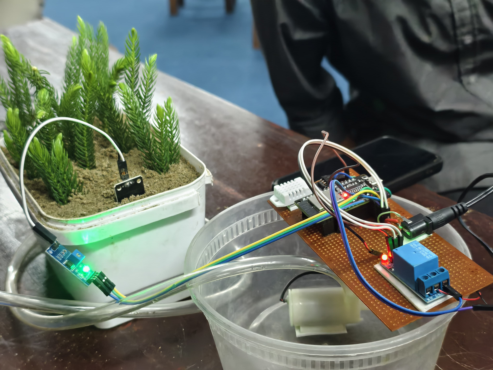
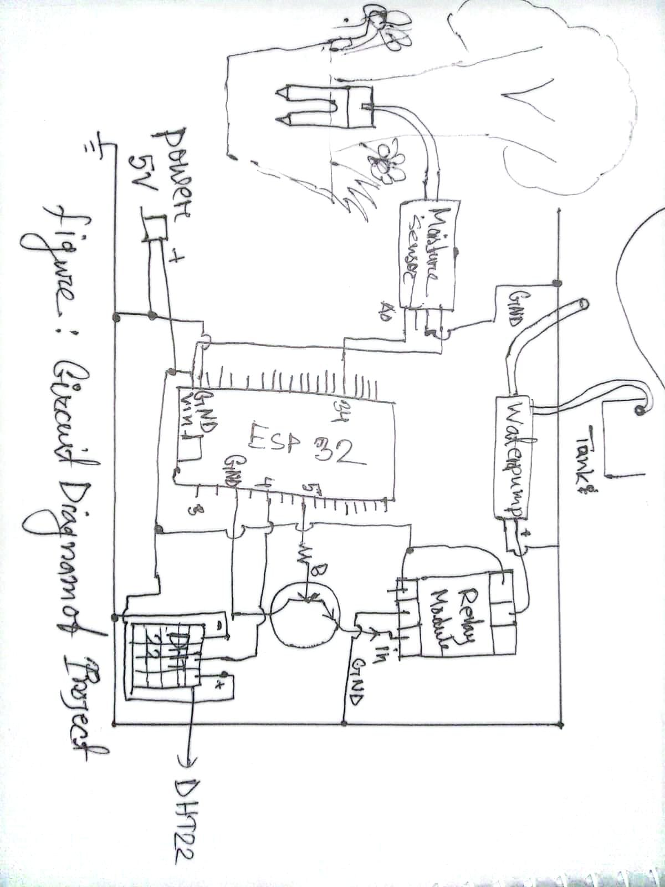
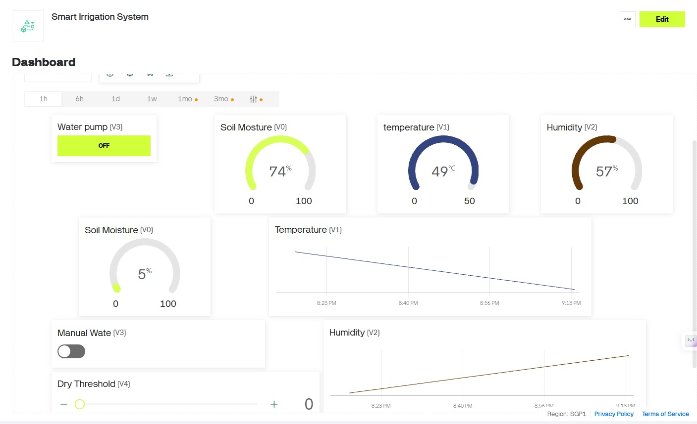
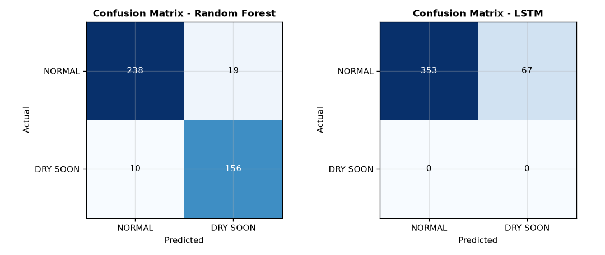
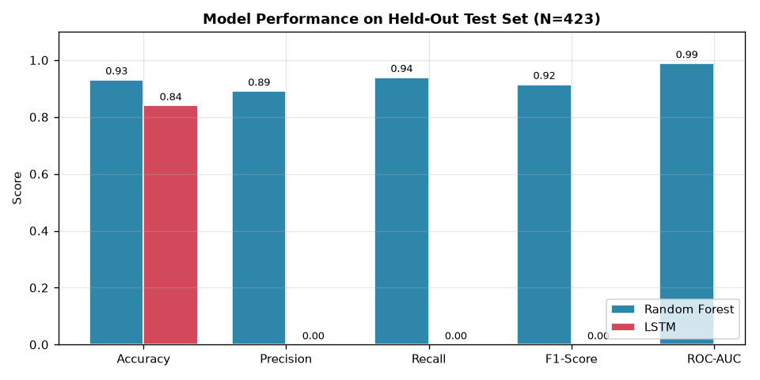
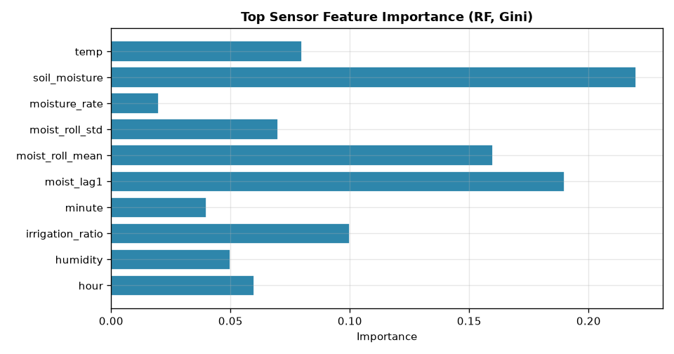
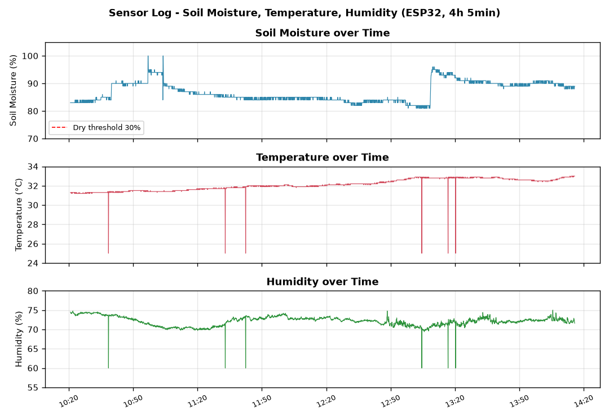
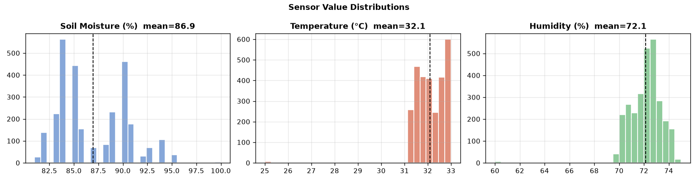
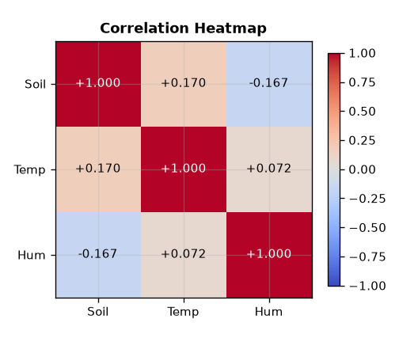

# IoT-Based Smart Irrigation System

A low-cost embedded IoT system that combines ESP32 microcontrollers, on-device Machine Learning (Edge AI), and Blynk Cloud to enable predictive, autonomous plant irrigation. The system monitors soil moisture, temperature, and humidity in real time, uses a Random Forest model to predict "dry soon" conditions before plant stress occurs, and actuates a water pump accordingly.

---

## Overview

Traditional irrigation methods are inherently inefficient — leading to both over-watering and under-watering. This project delivers a self-contained, edge-computing solution that processes sensor data locally on an ESP32, runs ML inference on-device, and makes autonomous watering decisions with no cloud dependency for core logic. A Blynk dashboard provides remote visibility and manual control when needed.

---

## System Architecture




The system operates on a cyclical low-power loop:

1. **Wake-up** — ESP32 exits Deep Sleep every 5 minutes
2. **Acquisition** — Sensors sample soil moisture, temperature, and humidity
3. **Signal Conditioning** — Analog moisture data is filtered and scaled via ESP32 ADC
4. **Edge Inference** — The on-device ML model classifies the soil state
5. **Actuation** — If "Dry Soon" or threshold reached, the relay triggers the pump for 10 seconds
6. **Telemetry** — Data is synchronized with Blynk Cloud via WiFi
7. **Deep Sleep** — System re-enters low-power mode to conserve energy

```
[ Physical Sensors ] → [ ADC Filtering/Scaling ] → [ ML Inference Engine (ESP32) ]
                                                        |
                                               [ Decision Logic ]
                                               /              \
                              [ Actuator: Relay/Pump ]      [ WiFi: Blynk Cloud ]
```

---

## Prototype



---

## Circuit & Wiring




### Pin Configuration

| Pin | Component | Direction |
|---|---|---|
| GPIO 34 | Soil Moisture Sensor (ADC) | Input |
| GPIO 4 | DHT22 Data | Input |
| GPIO 5 | Relay Module | Output |
| GPIO 2 | LED Indicator | Output |
| GPIO 0 | Reset Button (active LOW) | Input |

---

## Blynk Dashboard



The Blynk dashboard provides real-time telemetry for soil moisture, temperature, and humidity, along with manual pump control and threshold configuration.

---

## Serial Monitor Output


---

## ML Model Performance







| Metric | Value |
|---|---|
| Model Accuracy | 93.14% |
| F1-Score | 0.915 |
| ROC-AUC | 0.989 |
| 5-Fold CV Weighted F1 | 0.957 ± 0.009 |
| Water Waste Reduction | 30–50% |
| Manual Intervention Reduction | ~90% |

---

## Sensor Data Visualization







---

## Key Features

- **Edge ML Inference** — On-device Random Forest classifier (TensorFlow Lite Micro) predicts "dry soon" conditions before threshold-based triggers
- **Autonomous Actuation** — Relay-controlled water pump with configurable dry threshold and 10-second watering cycles
- **Cloud Dashboard** — Blynk Cloud integration for remote monitoring and manual override
- **Low-Power Design** — ESP32 Deep Sleep mode (≈10 µA) with 5-minute wake cycles
- **Local Web Server** — Built-in HTTP API for data retrieval (`/api/data`) and manual watering (`/api/water`)
- **WiFi Auto-Connect** — WiFiManager for captive-portal-based network configuration
- **Reset Mechanism** — 5-second button hold resets WiFi settings and restarts the device

---

## Hardware Components

| Component | Model/Qty | Purpose | Key Specification |
|---|---|---|---|
| ESP32 Dev Board | 1 | Microcontroller with WiFi/Bluetooth | Dual-core 240MHz, WiFi 802.11 b/g/n, Deep Sleep ~10µA |
| Capacitive Soil Moisture Sensor | 1 | Detect soil dryness | Analog output, 3.3–5V compatible |
| DHT22 Sensor | 1 | Temperature & Humidity | Digital GPIO, ±0.5°C accuracy |
| Relay Module | 1 | Trigger water pump | 5V, active LOW, 10A rated |
| Water Pump (5V) | 1 | Automated watering | Mini submersible, 5V DC |
| Water Reservoir & Tubing | 1 set | Irrigation setup | Flexible tubing, any size reservoir |

---

## Software & Libraries

- **Arduino IDE** — Firmware development
- **WiFiManager** — Automatic WiFi configuration via captive portal
- **Blynk** — Cloud dashboard and telemetry
- **DHT sensor library** — DHT22 temperature/humidity readings
- **TensorFlow Lite Micro** — On-device ML inference
- **EloquentArduino** — ML model integration wrapper

---

## Setup & Installation

### Prerequisites

- Arduino IDE (latest stable)
- ESP32 board support package installed
- Python 3.x (for ML model training)

### Firmware Flashing

1. Open `Iot_based_Smart_irrigation_code.ino` in Arduino IDE
2. Select **ESP32 Dev Board** as the target
3. Connect the ESP32 via USB
4. Upload the sketch
5. The device will create a WiFi hotspot named `SmartIrrigation` (password: `12345678`)
6. Connect to the hotspot and configure your WiFi credentials via the captive portal

### ML Model Training

1. Open `Smart_Irrigation_ML_Notebook.ipynb` in Jupyter
2. Train the Random Forest model on the provided dataset (`10_20_to_1_28_dataset_of_SMart_Irrigation_system.csv`)
3. Export the trained model as a TFLite `.tflite` file
4. Deploy the `.tflite` model to the ESP32 using the EloquentArduino library

### Blynk Setup

1. Create a Blynk account at [blynk.cloud](https://blynk.cloud)
2. Create a new template with Template ID `TMPL6DXtzWswk`
3. Add virtual pins:
   - **V0** — Soil Moisture (%)
   - **V1** — Temperature (°C)
   - **V2** — Humidity (%)
   - **V3** — Manual pump control (switch)
   - **V4** — Dry threshold slider
   - **V5** — Pump status (LED/string)
4. Copy the Auth Token and update `BLYNK_AUTH_TOKEN` in the Arduino sketch

---

## Dataset

- **File:** `10_20_to_1_28_dataset_of_SMart_Irrigation_system.csv`
- **Size:** 2,819 samples collected over ~4 hours 5 minutes of continuous prototype operation
- **Features:** Soil moisture, temperature, humidity
- **Label:** Soil state classification (Normal / Dry Soon)

---

## Project Files

| File | Description |
|---|---|
| `Iot_based_Smart_irrigation_code.ino` | ESP32 Arduino firmware |
| `Smart_Irrigation_ML_Notebook.ipynb` | ML model training and evaluation notebook |
| `10_20_to_1_28_dataset_of_SMart_Irrigation_system.csv` | Sensor dataset (2,819 samples) |
| `figures/` | Figures and diagrams used in the report |
| `pic/` | Prototype and circuit photos |

---

## License

All rights reserved by the project team.